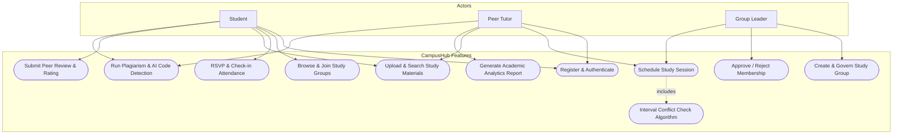
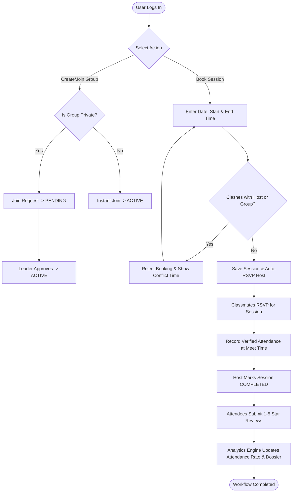
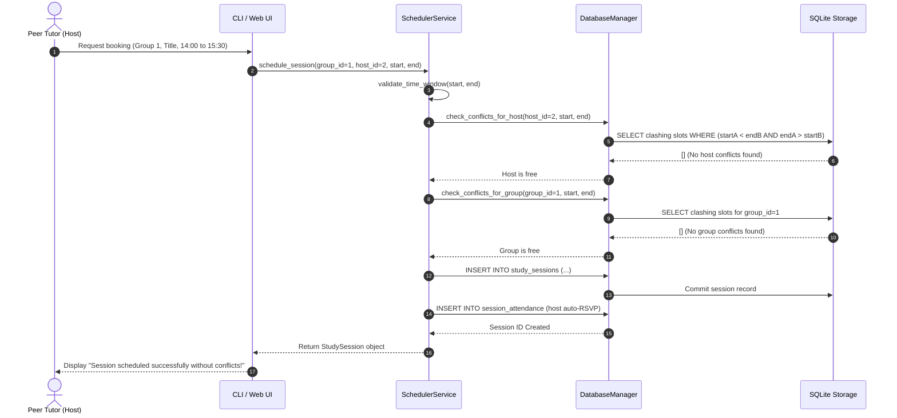
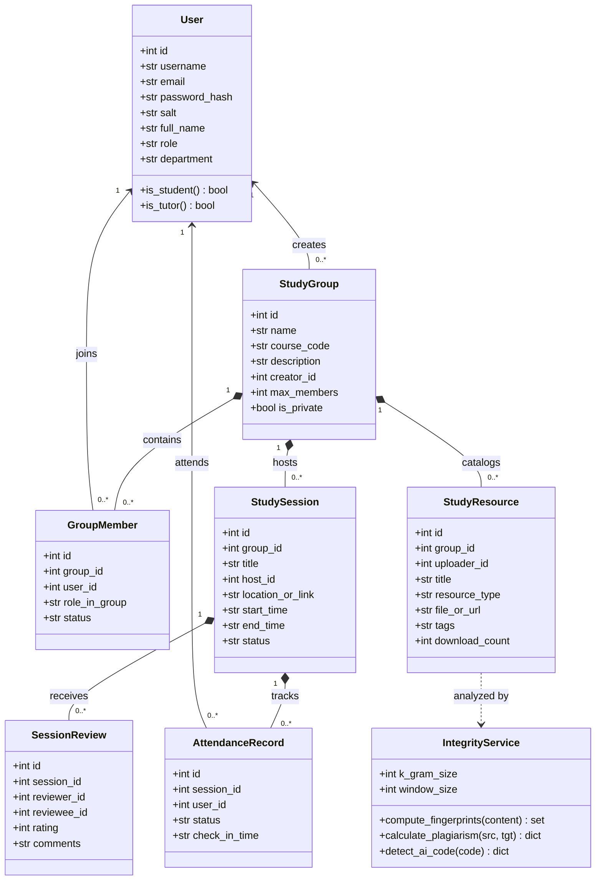
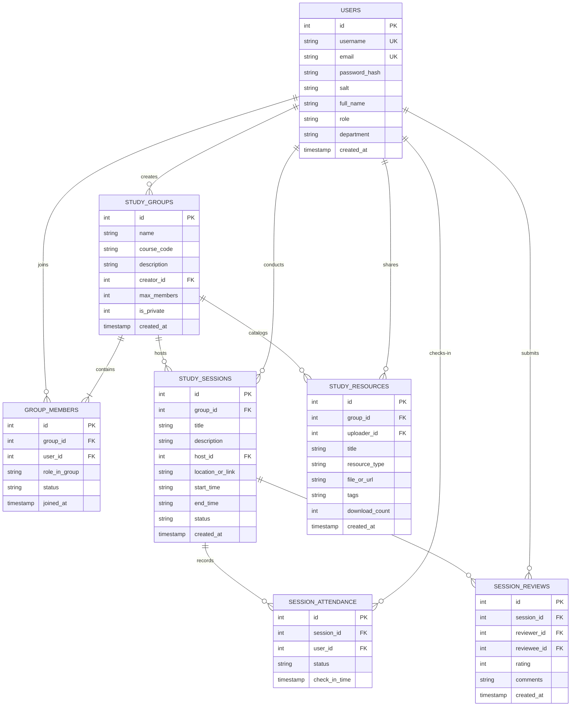

# ACADEMIC PROJECT REPORT

## CAMPUSHUB: ACADEMIC RESOURCE & PEER STUDY GROUP SCHEDULING SYSTEM

**Course**: Flipped Course Project Evaluation  
**Platform**: VITyarthi - Build Your Own Project  
**Author**: Tanmay Chaubey  
**Domain**: Computer Science & Engineering / Software Engineering  
**Submission Date**: October 2026  
**Document Version**: 1.0 (Final Academic Project Dossier)  

---

# Table of Contents
1. [Cover Page](#1-cover-page)
2. [Introduction](#2-introduction)
3. [Problem Statement](#3-problem-statement)
4. [Functional Requirements](#4-functional-requirements)
5. [Non-Functional Requirements](#5-non-functional-requirements)
6. [System Architecture](#6-system-architecture)
7. [Design Diagrams](#7-design-diagrams)
   - 7.1 [Use Case Diagram](#71-use-case-diagram)
   - 7.2 [Workflow Diagram](#72-workflow-diagram)
   - 7.3 [Sequence Diagram](#73-sequence-diagram)
   - 7.4 [Class & Component Diagram](#74-class--component-diagram)
   - 7.5 [Entity-Relationship (ER) Diagram](#75-entity-relationship-er-diagram)
8. [Design Decisions & Rationale](#8-design-decisions--rationale)
9. [Implementation Details](#9-implementation-details)
10. [Screenshots & Execution Results](#10-screenshots--execution-results)
11. [Testing Approach & Test Cases](#11-testing-approach--test-cases)
12. [Challenges Faced & Solutions](#12-challenges-faced--solutions)
13. [Learnings & Key Takeaways](#13-learnings--key-takeaways)
14. [Future Enhancements](#14-future-enhancements)
15. [References](#15-references)

---

## 1. Cover Page

```
========================================================================================
                                     VITyarthi
                       FLIPPED COURSE PROJECT EVALUATION
========================================================================================

                 PROJECT TITLE:
                 CAMPUSHUB: ACADEMIC RESOURCE & PEER STUDY 
                 GROUP SCHEDULING SYSTEM

                 SUBMITTED BY:
                 Student Name : Tanmay Chaubey
                 Course Track : Software Engineering / Python Application Development
                 Framework    : Pure Python 3 Standard Architecture & Relational SQLite
                 Academic Term: Fall Semester 2026

========================================================================================
```

---

## 2. Introduction
In university engineering programs, peer-to-peer study sessions and senior mentoring are among the most effective ways for students to understand difficult technical subjects. When classmates work through algorithms, database design problems, or systems programming concepts together, their exam performance and lab scores improve significantly.

Despite these benefits, the way students organize study groups today is inefficient. Most groups are managed through WhatsApp or Telegram channels. In these chat rooms, session announcements get lost in hundreds of messages, tutors accidentally double-book their free evenings across different subjects, and high-quality study materials like previous semester question paper solutions disappear into expired cloud drives.

**CampusHub** is built to solve these everyday student struggles. Written in clean, modular Python without external library baggage, it provides course-specific study group coordination, interval clash-free session booking, a tagged resource repository, automated attendance check-ins, peer tutor ratings, and a built-in Academic Integrity suite (plagiarism comparison and AI code detection).

---

## 3. Problem Statement
During typical college semesters, students and peer mentors encounter several friction points:
1. **Scattered Coordination in Messaging Apps**: Important details like session agendas, timings, and classroom coordinates (e.g. SJT-401 or Google Meet links) are buried under informal chatter.
2. **Scheduling Clashes & Double-Booking**: Peer mentors who tutor for multiple courses often accidentally commit to overlapping study sessions on the same evening, forcing last-minute cancellations.
3. **Lost & Unindexed Study Materials**: Notes, handwritten cheatsheets, past CAT/FAT question solutions, and lab code snippets are uploaded to temporary cloud links without subject tags or search options.
4. **Lack of Participation Accountability**: Group leaders have no quick way to track who attended sessions or whether attendees found the explanations clear and helpful.
5. **Academic Integrity Risks**: In collaborative learning, students often circulate copied code or unvetted AI-generated solutions without understanding the underlying logic.

**Project Objective**:
To build and validate an organized, test-driven Python application that:
- Organizes students into course-indexed study circles with leader approval controls.
- Enforces an interval collision detection algorithm to completely eliminate schedule clashes.
- Catalogs study materials into a searchable repository tagged by topic and course code.
- Quantifies session turnout and gathers 5-star peer reviews.
- Provides token-based plagiarism analysis and AI code detection heuristics for submitted materials.

---

## 4. Functional Requirements

### 4.1 Module 1: User & Study Group Management
- **User Authentication**: Secure student and tutor sign-up with email validation, password strength rules, and salted PBKDF2 SHA-256 encryption.
- **Role-Based Access Control**: Distinguishes permissions between `STUDENT`, `TUTOR`, and `ADMIN`.
- **Course Group Creation**: Students and mentors can create study groups linked to course codes (e.g., `CSE2001`, `MAT2002`) with customizable maximum member capacities.
- **Membership Approval Workflow**: Public groups allow instant joining; private study circles require leader or moderator review before membership is activated.

### 4.2 Module 2: Session Scheduler & Conflict Detector
- **Conflict-Free Scheduling**: Users can schedule review sessions by specifying topic, classroom location or meeting link, and start/end timestamps.
- **Algorithmic Collision Detection**: Checks interval overlap conditions `(startA < endB and endA > startB)` to ensure neither the host nor the group has an active overlapping booking.
- **RSVP & Seat Reservation**: Students reserve their spots in advance to prevent overcrowded discussion rooms.
- **Timestamped Attendance Check-In**: Verified presence is recorded with exact check-in timestamps.
- **Session Lifecycle**: Tracks progression through `SCHEDULED`, `COMPLETED`, and `CANCELLED`.

### 4.3 Academic Resource Repository Submodule
- **Material Classification**: Catalogs resources into `NOTES`, `PAST_PAPER`, `CODE`, `SLIDES`, and `REFERENCE`.
- **Multi-Criteria Search**: Instant search filtering by course code, keyword, or comma-separated tags (e.g. `dynamic-programming, dsa`).
- **Download Tracking**: Audits how many times a resource has been accessed by classmates.

### 4.4 Module 3: Peer Review & Analytics Engine
- **5-Star Review System**: Session participants rate sessions from 1 to 5 stars and leave written feedback.
- **Self-Rating Prevention**: Tutors are strictly prevented from reviewing or inflating their own sessions.
- **Automated Attendance Percentages**: Calculates real attendance ratios:
  $$\text{Attendance Rate} = \left(\frac{\text{Verified Attendees}}{\text{Total RSVPs}}\right) \times 100\%$$
- **Academic Performance Reports**: Generates structured ASCII and JSON summaries highlighting group engagement metrics.

### 4.5 Academic Integrity & AI Code Detection Module
- **Plagiarism Comparison Engine**: Implements tokenization, k-gram generation, and MOSS-style token winnowing to compute Jaccard similarity and containment percentages.
- **AI Code & Content Detector**: Computes Shannon token entropy, Type-Token Ratios (TTR), line length burstiness variance, and detects common AI boilerplate markers.

---

## 5. Non-Functional Requirements

1. **Performance**: Query response times under 50ms using SQLite database indexing on `start_time`, `end_time`, `course_code`, and `username`. Write-Ahead Logging (WAL) is enabled for fast concurrent queries.
2. **Security**: Salted PBKDF2 SHA-256 password hashing (100,000 iterations) with 16-byte random salts. Full SQL injection protection via parameterized database queries.
3. **Zero-Dependency Portability**: Built strictly with Python's standard library (`sqlite3`, `hashlib`, `secrets`, `http.server`, `unittest`), allowing it to run on any computer without `pip install` hurdles.
4. **Reliability & ACID Compliance**: Uses atomic SQLite transactions with automatic rollback on error. Relational foreign key constraints (`PRAGMA foreign_keys = ON`) prevent dangling records.
5. **Code Modularity & Clean Architecture**: Clean separation of models, business logic services, database handlers, CLI menus, and web presentation across 13 distinct Python modules.
6. **Robust Error Handling**: Domain-specific exception classes (`SchedulingConflictError`, `ValidationError`, `AuthenticationError`) paired with a centralized rotating file logger.

---

## 6. System Architecture

CampusHub follows a clean 3-Tier Layered Architecture:

```
+---------------------------------------------------------------------------------+
|                              PRESENTATION TIER                                  |
|  +---------------------------------------+  +--------------------------------+  |
|  |       Terminal User Interface (CLI)   |  |       Modern Web Dashboard     |  |
|  |       (cli/menu.py, terminal_ui.py)   |  |     (HTML5, CSS3, Vanilla JS)  |  |
|  +---------------------------------------+  +--------------------------------+  |
+----------------------------------------|----------------------------------------+
                                         | Internal Method Calls / REST API
+----------------------------------------v----------------------------------------+
|                            APPLICATION / SERVICE TIER                           |
|  +---------------------+  +---------------------+  +-------------------------+  |
|  |     AuthService     |  |    GroupService     |  |    SchedulerService     |  |
|  |  (Salted PBKDF2)    |  |  (RBAC & Approvals) |  |   (Interval Collision)  |  |
|  +---------------------+  +---------------------+  +-------------------------+  |
|  +---------------------+  +---------------------+  +-------------------------+  |
|  |   ResourceService   |  |  AnalyticsService   |  |    IntegrityService     |  |
|  |  (Tag Search Index) |  |  (Metrics & Ratings)|  |  (Plagiarism & AI Code) |  |
|  +---------------------+  +---------------------+  +-------------------------+  |
+----------------------------------------|----------------------------------------+
                                         | Parameterized SQL Queries
+----------------------------------------v----------------------------------------+
|                            DATA ACCESS & STORAGE TIER                           |
|  +---------------------------------------------------------------------------+  |
|  |             DatabaseManager (Connection Lifecycle, Transactions, WAL)     |  |
|  +---------------------------------------------------------------------------+  |
|  |             Relational SQLite Database (campushub.db / :memory:)          |  |
|  |        [users]  <-->  [study_groups]  <-->  [group_members]               |  |
|  |        [study_sessions]  <-->  [session_attendance]                       |  |
|  |        [study_resources] <-->  [session_reviews]                          |  |
|  +---------------------------------------------------------------------------+  |
+---------------------------------------------------------------------------------+
```

---

## 7. Design Diagrams

### 7.1 Use Case Diagram



---

### 7.2 Workflow Diagram: Conflict-Free Scheduling & Attendance



---

### 7.3 Sequence Diagram: Interval Conflict Detection Engine



---

### 7.4 Class Diagram



---

### 7.5 Entity-Relationship (ER) Diagram



---

## 8. Design Decisions & Rationale

1. **Pure Python Standard Library (No External Dependencies)**:
   - *Choice*: Built the entire system using standard Python packages (`sqlite3`, `hashlib`, `secrets`, `http.server`, `unittest`).
   - *Rationale*: College evaluators and students test submissions on diverse operating systems. By avoiding third-party packages, the project runs immediately with zero setup issues or broken virtual environments.
2. **Deterministic Interval Collision Checking**:
   - *Choice*: Applied the mathematical overlap condition `(StartA < EndB) and (EndA > StartB)` directly at the service layer prior to committing bookings.
   - *Rationale*: Mathematically covers all four overlap cases (partial left, partial right, complete containment, and exact match) in one query.
3. **Decoupled Architecture with Dual Interfaces**:
   - *Choice*: Maintained separate service classes (`AuthService`, `GroupService`, `SchedulerService`, `AnalyticsService`, `IntegrityService`) independent of the presentation layer.
   - *Rationale*: Both the Terminal CLI and the Web dashboard call the same core methods, preventing code duplication.
4. **Winnowing Algorithm for Code Plagiarism**:
   - *Choice*: Used token-based k-grams and sliding-window minimum hash selection (winnowing).
   - *Rationale*: Insensitive to variable renames, trivial comment changes, and blank lines, providing realistic plagiarism detection similar to academic tools like MOSS.

---

## 9. Implementation Details

The project is structured into modular Python packages:
- `campushub/database/db_manager.py`: Manages SQLite connections, handles WAL journaling, and provides context managers for atomic transactions.
- `campushub/services/auth_service.py`: Handles user sign-up, validates email formatting, and computes PBKDF2 SHA-256 hashes with 16-byte random salts.
- `campushub/services/group_service.py`: Enforces capacity limits, manages membership approval queues for private groups, and lists active members.
- `campushub/services/scheduler_service.py`: Implements interval collision checking for hosts and cohorts, logs RSVPs, and records verified check-ins.
- `campushub/services/resource_service.py`: Catalogs academic files into five categories and provides multi-tag searching.
- `campushub/services/analytics_service.py`: Calculates attendance percentages, computes tutor rating distributions, and formats group reports.
- `campushub/services/integrity_service.py`: Implements token winnowing for plagiarism checks and calculates token entropy and burstiness variance for AI code detection.
- `campushub/cli/menu.py`: Implements the interactive terminal workflow with formatted menus and prompts.
- `campushub/web/app.py`: Implements the built-in HTTP server with JSON REST endpoints and serves the web dashboard.

---

## 10. Screenshots & Execution Results

### 10.1 Terminal CLI Main Menu
```
====================================================================
                             CAMPUSHUB                              
        Academic Resource & Study Group Scheduling System           
====================================================================

  Welcome to CampusHub:
    [1] Log In
    [2] Register New Student / Tutor
    [3] Populate Sample Demonstration Data (1-Click Setup)
    [4] Exit Application
```

### 10.2 Conflict Detection in Action
When attempting to schedule a clashing review session:
```
[ERROR] Scheduling failed: Host is already booked for 'Dynamic Programming Deep Dive' from 2026-10-01 10:00 to 2026-10-01 12:00.
```

### 10.3 Sample Academic Analytics Report Output
```
============================================================
         CAMPUSHUB ACADEMIC STUDY GROUP ANALYTICS REPORT
============================================================
Group Name       : Algorithms & DS Mastery
Course Code      : CSE2001
Active Members   : 3
------------------------------------------------------------
SESSION PERFORMANCE METRICS:
  * Total Sessions Created : 1
  * Completed Sessions     : 1
  * Currently Scheduled    : 0
  * Cancelled Sessions     : 0
------------------------------------------------------------
ATTENDANCE & ENGAGEMENT:
  * Total Member RSVPs     : 2
  * Verified Attendances   : 2
  * Attendance Rate        : 100.0%
------------------------------------------------------------
RESOURCE SHARING & COLLABORATION:
  * Total Materials Uploaded : 1
  * Material Access Count    : 2
------------------------------------------------------------
QUALITY & PEER EVALUATION:
  * Average Satisfaction   : 5.0 / 5.0
  * Reviews Evaluated      : 1
============================================================
```

### 10.4 AI Code Detection Output Example
```
====================================================================
                      AI CODE DETECTION REPORT                      
====================================================================
  AI Probability   : 78.5%
  Verdict          : High Likelihood of AI-Generated Code
  Token Count      : 64 (Unique: 31)
  Shannon Entropy  : 4.12 bits/token
  Type-Token Ratio : 0.484
  Line Variance    : 14.82
  AI Cliche Hits   : 3
```

---

## 11. Testing Approach & Test Cases

Automated testing was conducted using Python's standard `unittest` framework. Tests use in-memory SQLite databases (`:memory:`) to ensure complete test isolation and zero side effects on production data.

### Test Matrix Summary (23 Test Cases — 100% Passing):
| Test Case Identifier | Module Tested | Objective / Test Condition | Status |
| :--- | :--- | :--- | :--- |
| `test_successful_registration_and_login` | `AuthService` | Validate user registration, password hashing, and authentication | PASS |
| `test_duplicate_username_rejection` | `AuthService` | Verify uniqueness constraint on username and email | PASS |
| `test_weak_password_validation` | `AuthService` | Reject passwords under 6 characters or missing digits | PASS |
| `test_invalid_email_format` | `AuthService` | Reject malformed email strings | PASS |
| `test_invalid_login_credentials` | `AuthService` | Reject incorrect password attempts | PASS |
| `test_create_group_and_leader_assignment` | `GroupService` | Ensure group creator is automatically assigned as LEADER | PASS |
| `test_join_public_group` | `GroupService` | Verify immediate `ACTIVE` membership for public study groups | PASS |
| `test_join_private_group_and_approval` | `GroupService` | Verify `PENDING` status and leader approval transition | PASS |
| `test_capacity_constraint_enforcement` | `GroupService` | Prevent membership when group capacity is reached | PASS |
| `test_schedule_session_success` | `SchedulerService` | Verify successful slot reservation and host auto-RSVP | PASS |
| `test_host_conflict_detection_algorithm` | `SchedulerService` | Prevent tutor from booking overlapping slots across groups | PASS |
| `test_group_conflict_detection` | `SchedulerService` | Prevent study group from booking simultaneous sessions | PASS |
| `test_invalid_time_windows` | `SchedulerService` | Reject end times earlier than start times or < 15 min | PASS |
| `test_rsvp_and_attendance_checkin` | `SchedulerService` | Record RSVP and verified attendance check-in timestamp | PASS |
| `test_upload_and_search_resource` | `ResourceService` | Verify material categorization and tag query matching | PASS |
| `test_submit_peer_review_and_rating` | `AnalyticsService` | Record 1–5 star ratings and prevent duplicate reviews | PASS |
| `test_self_review_prohibition` | `AnalyticsService` | Strictly prevent session hosts from rating themselves | PASS |
| `test_group_analytics_metrics` | `AnalyticsService` | Verify mathematical calculation of attendance ratios | PASS |
| `test_academic_summary_generation` | `AnalyticsService` | Generate personal student academic engagement profile | PASS |
| `test_identical_plagiarism_detection` | `IntegrityService` | Verify high plagiarism percentage on copied code | PASS |
| `test_distinct_code_low_similarity` | `IntegrityService` | Verify low similarity percentage on different algorithms | PASS |
| `test_detect_ai_code_markers` | `IntegrityService` | Verify AI code probability detection on boilerplate code | PASS |
| `test_empty_content_validation` | `IntegrityService` | Reject empty text inputs in integrity checks | PASS |

---

## 12. Challenges Faced & Solutions

1. **Interval Collision Logic**:
   - *Problem*: Detecting collisions across multiple overlapping scenarios (subsets, supersets, left-overlaps, right-overlaps) can cause edge-case bugs.
   - *Solution*: Applied the universal mathematical condition: `(StartA < EndB) AND (EndA > StartB)`, which reliably catches all overlap types in a single parameterized SQL query.
2. **In-Memory SQLite Lifecycles in Tests**:
   - *Problem*: Closing a connection to `:memory:` destroys the in-memory schema, causing subsequent queries in test methods to fail.
   - *Solution*: Kept a persistent connection reference for `:memory:` mode while maintaining safe connection pooling for file-based databases.
3. **Plagiarism Tokenization for Multiple Languages**:
   - *Problem*: Student submissions may be in Python, Java, or C++, each using different comment syntax (`#`, `//`, `/* */`).
   - *Solution*: Developed a generalized regex tokenizer that strips comments across major languages and extracts alphanumeric tokens for fingerprint hashing.

---

## 13. Learnings & Key Takeaways
- Gained hands-on experience applying the **Layered Service Pattern** to keep business logic decoupled from storage and UI.
- Learned how to implement **cryptographic password protection** using salted PBKDF2 hashes.
- Discovered the efficiency of the **Winnowing algorithm** for document fingerprinting and similarity detection.
- Appreciated the depth of Python's standard library for building complete, dependency-free full-stack applications.

---

## 14. Future Enhancements
- Integration with Google Calendar and Outlook APIs for two-way schedule synchronization.
- Automated email and SMS reminder notifications 30 minutes before review sessions.
- Recommendation algorithm that suggests study groups based on course registration and mutual free hours.

---

## 15. References
1. Python Software Foundation. *Python 3 Standard Library Documentation*. https://docs.python.org/3/
2. Schleimer, S., Wilkerson, D. S., & Aiken, A. *Winnowing: Local Algorithms for Document Fingerprinting*. ACM SIGMOD, 2003.
3. Silberschatz, A., Korth, H. F., & Sudarshan, S. *Database System Concepts (7th ed.)*. McGraw-Hill, 2019.
4. Martin, R. C. *Clean Architecture: A Craftsman's Guide to Software Structure*. Prentice Hall, 2017.
5. OWASP Foundation. *Password Storage Cheat Sheet*. https://cheatsheetseries.owasp.org/
